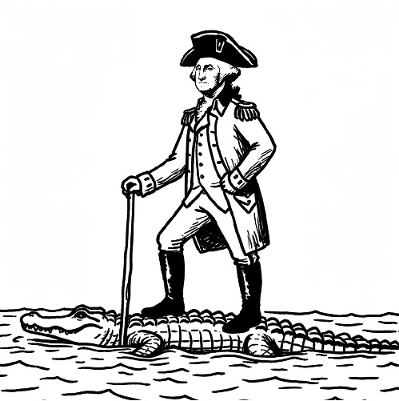

# On a Scale Of
## Required Elements
- Pen/Pencil/Dry Erase Marker
- Individual small drawing surface that can be moved around the table
- Deck of cards with the numbers 1-100
- [A list of scales](./scales.md)
## Setup
- Each player should have their own individual drawing implements
- Shuffle the deck of number cards
## Play
- The active player chooses a scale from the list or makes up a scale
- Each player is dealt a card face down
- Players look at their card but keep their number secret
- Players take 2 minutes to draw their representation of their number on the scale selected
- If the scale is Car to Truck and the player’s number is 25, the player may draw a car with a small pickup bed on it, or any other representation that is most of the way car, but a little bit truck.
- All drawings are put into the middle and players work collaboratively to put them in order from lowest to highest.
- Players may not say what their number is.
- Players may not comment on their own drawing except to say they think it should or should not swap with a drawing beside it.
- Once the players agree on an order, all players place their cards on their drawing, face down.
- The active player now reveals the cards, one at a time, from left to right.
- If the numbers are in order, the players win the round. If not, the players do not win the round.
- A new active player is chosen and repeat until the group is done.

*Washington to Florida*